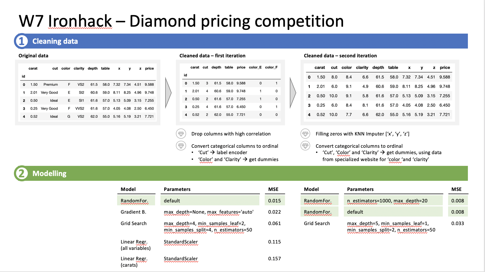

# diamond-competition-kaggle

## Introduction

The final weekly project in the Data Analytics Bootcamp is a competition to find the best model for prediction diamond prices based on nine given variables:
    - carat
    - cut
    - color
    - clarity
    - depth
    - table
    - x
    - y
    - z

Two datasets were given as part of the competition: one for training the models, including the actual price, and one without prices to test the models 

## Libraries used

During the project, I have used the following libraries:
- [Sklearn](https://scikit-learn.org/stable/modules/classes.html)
- [Pandas](https://pandas.pydata.org/)
- [Numpy](https://numpy.org/doc/)
- [Matplotlib](https://matplotlib.org/stable/contents.html)
- [Seaborn](https://seaborn.pydata.org/)

You can find links to the official documentation of each library at the end, under Links & Resources

## Work done

As a first step, I cleaned the dataset to make it ready for the machine learning models. This included converting categorical variables to ordinal, checking for highly correlated variables that could be droped and checking for possible empty variables or zeros that had to be removed and/or encoded. In this case, I used label encoders and get dummies to convert categorical variables and KNN Imputer to fill in zeros in x,y,z.

Following the data cleaning process, I trained various machine learning models included in sklearn t predict diamond prices. I used linear regression, random forests, grid search and gradient boosting. Work and results are summarized in the following slide:

